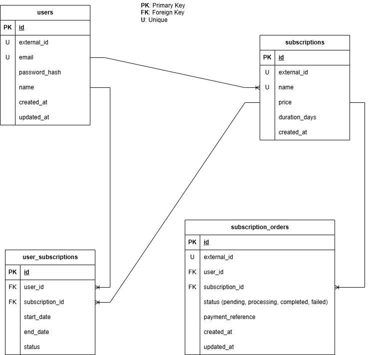

# Quickstart: Run the API with Docker

This project includes a full Docker setup for running the backend API and PostgreSQL database.

## 1. Prerequisites

Make sure you have installed:

- Docker
- Docker Compose

Create a `.env` file in the same directory as `docker-compose.yaml`:

PG_DB_USER=...
PG_DB_PASSWORD=...
PG_DB_NAME=...
PG_DB_SSL=false
PG_MAX_CONNECTIONS=10
PORT=3000
JWT_SECRET=your_jwt_secret_key
NODE_ENV=production

## 2. Start the Application

From the project root, run:

docker compose up --build -d

This will:

1. Build the backend image
2. Start the PostgreSQL database
3. Wait for the database to become healthy
4. Run migrations
5. Launch the backend API

The API will be available at:

http://localhost:3000

## 3. API Endpoints

### Create a New User
POST /api/user

Use this endpoint to register a new user.

Request Body:

{
  "email": "example@example.com",
  "password": "your-password"
  "name": "John"
}

Response Example (200 OK):

{
    "id": "8b7181fa-bbb4-40cc-ad83-a2472e98f0b4",
    "email": "example@example.com",
    "name": "John",
    "createdAt": "2026-01-08T14:20:20.265Z"
}

---

### Login
POST /api/login

Returns a JWT token for authenticated requests.

Request Body Example:

{
  "email": "example@example.com",
  "password": "your-password"
}

Response Example (200 OK):

{
  "id": "JWT_TOKEN_HERE",
  "token": "eyJhbGciOiJIUzI1NiIsInR5cCI6....."
}

---

### Get Authenticated User Profile
GET /api/user/profile

Requires a valid JWT token in the Authorization header:

Authorization: Bearer <your-token>

Response Example:

{
    "id": "8b7181fa-bbb4-40cc-ad83-a2472e98f0b4",
    "email": "example@example.com",
    "name": "Jonh"
}

## 4. Stopping the Services

To stop all containers:

docker compose down

To stop and remove volumes (including database data):

docker compose down -v

## 5. Troubleshooting

- Ensure `.env` is in the same directory as `docker-compose.yml`
- Ensure `.env` uses UTF-8 encoding and LF line endings
- Run `docker compose config` to verify environment variables are loaded correctly
- If the backend fails to connect to the database, ensure the DB container is healthy

---

# Database Migrations

Below is a short explanation about migrations, seeders and the database schema.
Make sure you read the prerequisites before running migrations/seeders

```
src/infrastructure/database/migrations/
```

Each migration file contains two functions:

```ts
export const up = async (db) => { /* apply schema changes */ };
export const down = async (db) => { /* rollback schema changes */ };
```

The migration runner automatically:

- Creates a `migrations` tracking table  
- Applies only migrations that have not been executed yet  
- Records each successful migration  
- Supports rolling back migrations in reverse order  
- Prevents duplicate execution even if run multiple times  

---

# Database Model

Below is the logical database model used by the backend.

> ```md
> 
> ```
---

## Apply Migrations (UP)

To apply all pending migrations:

```bash
npm run migrate:up
```

This command will:

- Load environment variables (remenber to create .env file) 
- Connect to the database  
- Check which migrations have not been applied  
- Execute them in ascending order  
- Insert each migration name into the `migrations` table  

If you run this command multiple times, previously applied migrations will be skipped automatically.

---

## Roll Back Migrations (DOWN)

To revert previously applied migrations:

```bash
npm run migrate:down
```

This will:

- Reverse the migration order  
- Execute each migration’s `down()` function  
- Remove the migration name from the `migrations` table  

Only migrations that were previously applied will be rolled back.

---
# Database Seeders

All seeders are stored in:

```
src/infrastructure/database/seeders/
```

Each seeder file exports two functions:

```ts
export const up = async (db) => { /* insert data */ };
export const down = async (db) => { /* remove data */ };
```

The seeder runner automatically:

- Creates a `seeders` tracking table  
- Applies only seeders that have not been executed yet  
- Records each successful seeder  
- Supports rolling back seeders in reverse order  
- Prevents duplicate data insertion  

This ensures your database remains consistent and avoids duplicate seed entries.

---

## Apply Seeders (UP)

To run all pending seeders:

```bash
npm run seed:up
```
---

## Roll Back Seeders (DOWN)

To revert previously applied seeders:

```bash
npm run seed:down
```
---
# Environment Setup

Before running the application or executing any database migrations/seeders, you must create a `.env` file in the **root directory** of the project.

This file contains all required environment variables used by the application and the database connection.

Create a new `.env` file:

```
touch .env
```

Then add the required variables:

```env
DB_USER=...
DB_PASSWORD=...
DB_HOST=...
DB_PORT=5432
DB_NAME=...
DB_SSL=false
DB_MAX_CONNECTIONS=10
```

> **Note:**  
> If you are running the application outside of Docker, you may want to set `DB_HOST=localhost` instead of `postgres`.

---

# Starting the PostgreSQL Database

This project includes a Docker Compose setup for running PostgreSQL locally.

After creating your `.env` file, start the database container:

```bash
docker compose up -d
```

This will:

- Launch a PostgreSQL instance  
- Expose it on port `5432`  
- Create the database defined in your `.env`  
- Persist data using a Docker volume  

Once the container is running, you can safely run migrations and seeders.

